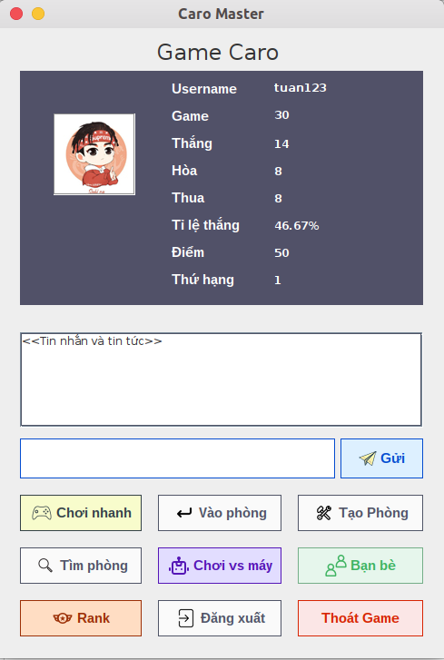
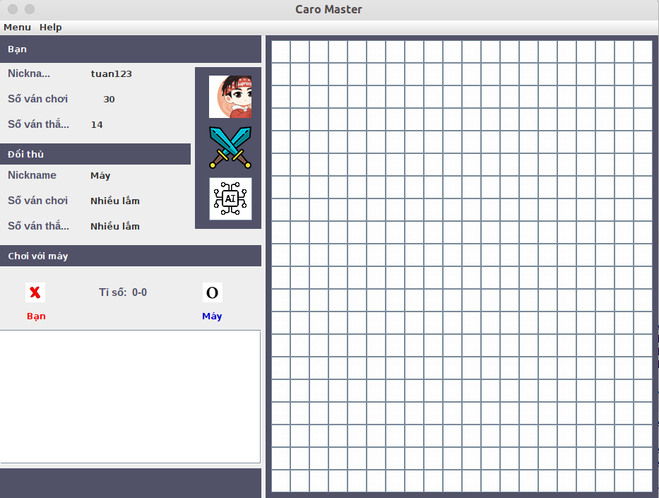
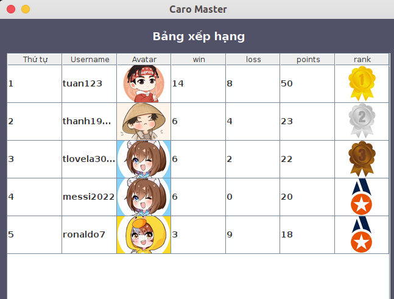
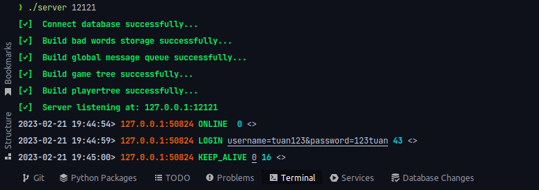
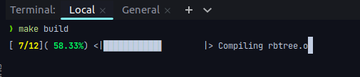

# CARO MASTER

## Introduce
- The `Caro` is also known as playing `XO`. This is considered **a folk game** and appeared for a long time in Vietnam. 
  How many generations of Vietnamese people have played this type of chess. Especially at school age.
  Not only in Vietnam, the caro game is also a popular game throughout Asia. Countries like _China_, 
  _Japan_ or _Korea_ all have checkered flags. However, the name of this game is also different with different 
  countries. In China, people will call the checkered flag **Wuziqi**, Japan will call it **Gomoku Narabe**, 
  and Korea will call it **Omok**.    

- Rule:
  Two players take turns playing. The first player plays X, the second player hits O. 
  Your task is to **reach a straight line or diagonal or horizontal line with 5 tiles fastest**.
  You have 60 seconds for each turn, over 60 seconds you will lose.
  When asking for a draw, if the opponent agrees, the current game will be counted as a draw.
  With each game you get 3 more points if you win, 1 point if you draw and 0 points if you lose.
  Have fun playing the game 

## Network Program - Use Socket

- Model: Client - Server

- Client: `Java` (Swing)
  - Nice UI    
      
  - Features:
    - Quick play
    - Find room
    - Create room
    - Room list
    - Play with AI    
        
    - Friend list / add friend / view online
    - Duel request
    - Rank    
        
    - Chat: global / in game
    - Login / Register
         
- Server: `C`
  - TCP
  - Multi-threading - mutex lock
  - Socket configure - so_recvtimeo, so_keepalive
  - Recv timeout
  - Keep-alive
  - Signal handler
  - Params parser
  - Chat filter
  - Nice logger    
      
  - Controller: auth, game, player
  - 3-rd library: rbtree, clist
       
- Database: `MySQL` - include 3 tables:
  - players
  - friends
  - histories
       
- Makefile: Use `python` to create awesome loading progress bar for compiling file .c    
  

## How to run
- Server:
  - `make clean`
  - `make build`
  - `./server 12121`
       
- Client:
  - Click right mouse -> Open in Terminal
  - First you need to grant permission for the application to execute: ``sudo chmod +x dist/CaroMaster.java`` 
  - Good! Now run app by command: ``javac -jar dist/CaroMaster.java``

## Run on multiple computers
- ``Coming soon``

## Reference
[UI Caro] <https://github.com/Duc-ju/caro-game-client>